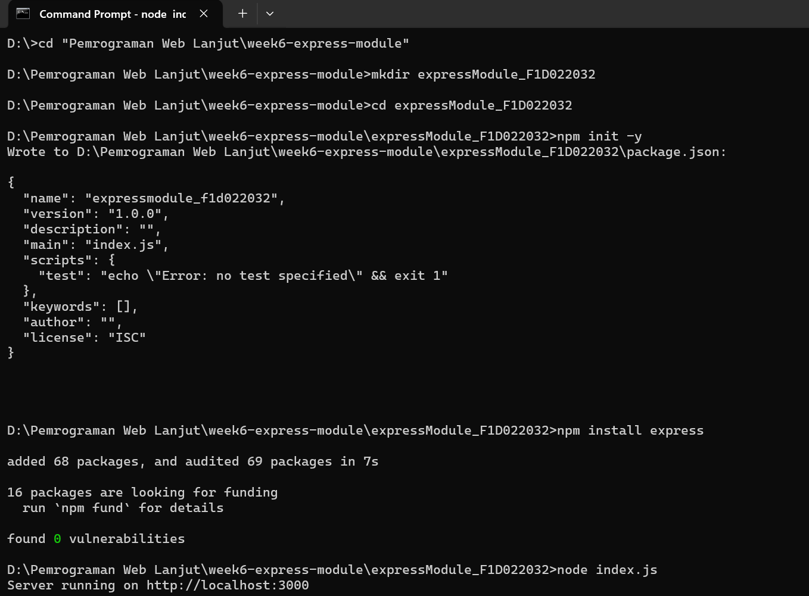
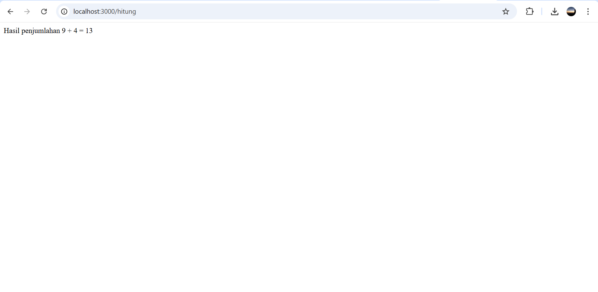
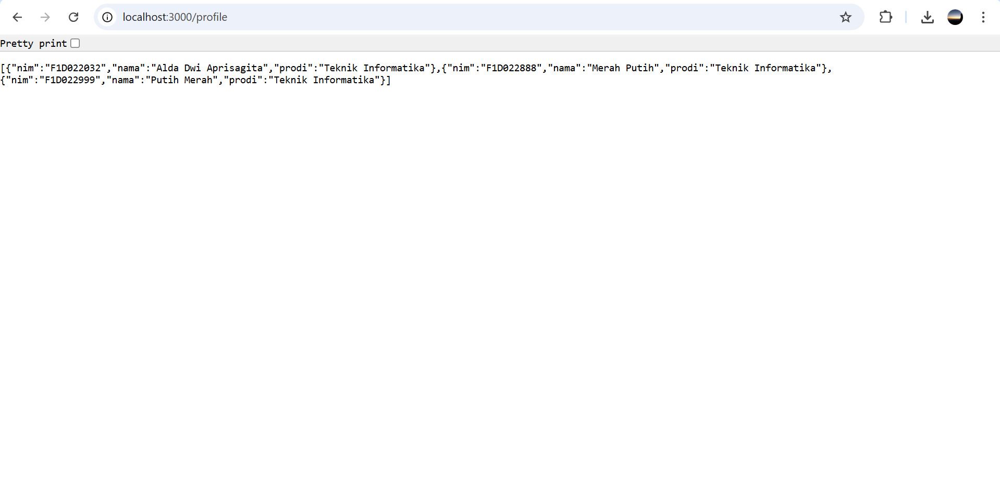
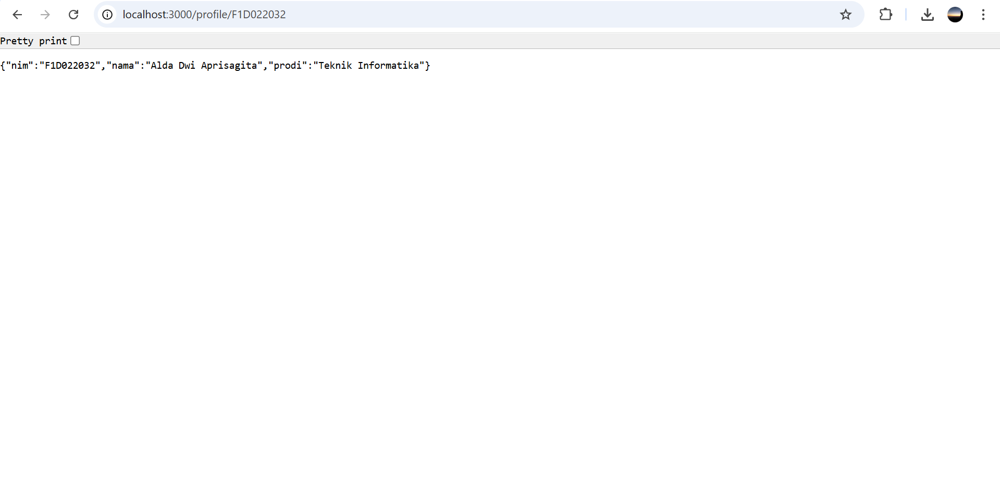

# week6-express-module

# Assignment: Express.js & Modul Node.js

## Identitas

- Nama : Alda Dwi Aprisagita
- NIM : F1D022032

---

## Deskripsi Tugas

Sebuah server sederhana dengan Express.js, kemudian memanfaatkan modul yang dibuat. Server memiliki beberapa route, yaitu menampilkan NIM dan Nama, melakukan operasi matematika sederhana seperti operasi tambah, kali, kurang, dan bagi melalui modul math.js, serta menampilkan data profil dalam format JSON melalui modul profile.js.

## Hasil

### Inisialisasi dan Menjalankan Server Express.js

Proses membuat project Node.js, menginstal Express, dan menjalankan server hingga berhasil aktif di http://localhost:3000.

### Tampilan Output Server Express.js pada Browser

Hasil dari server Express.js yang dijalankan pada alamat http://localhost:3000. Pada halaman browser terlihat informasi identitas. Hal ini menunjukkan bahwa server berhasil menampilkan respon sesuai kode yang ditulis pada file index.js.

### Hasil Operasi Penjumlahan pada Route Express.js

Tampilan browser pada alamat http://localhost:3000/hitung yang menampilkan hasil operasi penjumlahan. Server Express.js memproses input angka 9 dan 4, kemudian mengembalikan respon berupa teks “Hasil penjumlahan 9 + 4 = 13”.

### Output Data Profil dalam Format JSON pada Route Express.js

Gambar menunjukkan route /profile pada server Express.js berhasil menampilkan data mahasiswa dalam format JSON.

### Output Profil Mahasiswa

Hasil akses route /profile/F1D022032 pada server Express.js menampilkan data profil berdasarkan NIM dalam format JSON.
